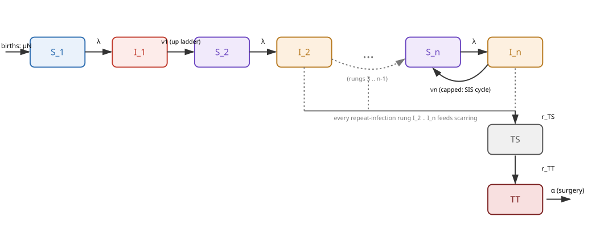

## What is this model?

This app extends the basic SIS model (`apps/sis`) with a **partial-immunity
ladder** of infection-history rungs, using the same continuous formulation
as the full research model (`trachoma_first_principles_300_history.R` in
the main modelling repository) - but with no age structure, so the ladder
mechanics are easier to see on their own. See the companion Shiny
prototype, `teaching_app_ladder`, for the same model with more interactive
controls.

### Compartments

- **S_1 ... S_n** - susceptible, by number of past infections
- **I_1 ... I_n** - currently infected, by number of past infections
- **TS** - trachomatous scarring (irreversible)
- **TT** - trachomatous trichiasis (irreversible, but resolvable e.g. by surgery)

Getting infected moves you $S_j \to I_j$ (same rung). Recovering from
$I_j$ moves you **up** to $S_{j+1}$ - except recovery from the **top**
rung $I_n$, which loops back to $S_n$ (there is nowhere higher to go).

### Diagram

Background births/deaths (rate $\mu = 1/\text{life expectancy}$) apply to
every rung (not drawn). The dashed lines show that **every**
repeat-infection rung ($I_2 \ldots I_n$) feeds the scarring accumulator -
first-ever infection ($I_1$) does not.

### Equations

$$
\nu_j = (\nu_0 - \nu_1)\, e^{-\text{nuExponent} \cdot (j-1)} + \nu_1
\qquad\qquad
l_j = e^{-\text{lExponent} \cdot (j-1)}
$$

$$
\lambda = \beta \frac{\sum_{j=1}^{n} l_j I_j}{N}
$$

$$
\frac{dS_1}{dt} = \mu N - \lambda S_1 - \mu S_1
\qquad
\frac{dI_1}{dt} = \lambda S_1 - (\nu_1 + \mu) I_1
$$

$$
\frac{dS_j}{dt} = \nu_{j-1} I_{j-1} - \lambda S_j - \mu S_j \quad (1 < j < n)
\qquad
\frac{dI_j}{dt} = \lambda S_j - (\nu_j + \mu) I_j \quad (1 < j \le n)
$$

$$
\frac{dS_n}{dt} = \nu_{n-1} I_{n-1} + \nu_n I_n - \lambda S_n - \mu S_n
$$

$$
\frac{dT_S}{dt} = r_{TS} \frac{\sum_{j \ge 2} I_j}{N} (N - T_S) - \mu T_S
\qquad
\frac{dT_T}{dt} = r_{TT} \frac{T_S}{N} (N - T_T) - (\alpha + \mu) T_T
$$

| Symbol | Meaning |
|---|---|
| `beta` | transmission intensity |
| `nu0`, `nu1`, `nuExponent` | recovery-rate-by-rung parameters |
| `lExponent` | infectiousness-decay-by-rung parameter |
| (rung count) | fixed at **5** rungs in this app - see note below |
| `r_TS`, `r_TT` | scarring / trichiasis accumulation rates |
| `alpha` | trichiasis resolution rate (e.g. surgery) |
| `life_expectancy` | sets $\mu = 1/\text{life expectancy}$ |

### A note on the fixed rung count

This model is written with $n=5$ rungs unrolled into plain named
variables (`S_1`..`S_5`, `I_1`..`I_5`) rather than as an odin array
(`S[i]`, `dim(S) <- n_rungs`). An array version was tried first and
compiled and ran correctly with the plain `odin` R package, but **WODIN
itself does not support odin's array syntax** - it rejected the array
version with a code validation error before ever reaching the model
compiler. Changing the number of rungs therefore means hand-editing (or
regenerating) this file with a different number of `S_j`/`I_j` pairs,
rather than adjusting a parameter.

See `trachoma_first_principles_300_history.R` and `teaching_app_ladder` in
the main modelling repository for the fuller model and an interactive
Shiny version with MDA support and an adjustable rung count.
