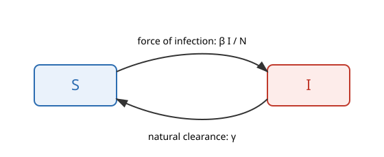

## What is this model?

This app is a **teaching tool** for exploring the transmission dynamics of
ocular *Chlamydia trachomatis* (trachoma) using a simple **SIS
(Susceptible-Infected-Susceptible)** compartmental model.

Trachoma is modelled as SIS rather than SIR because infection does **not**
confer lasting protective immunity. Longitudinal field studies (e.g. Bailey
et al. 1999; Grassly et al. 2008) show that individuals are repeatedly
re-infected throughout life. An SIR model would predict a single epidemic
wave followed by elimination, which is not what is observed in
trachoma-endemic communities.

This is intentionally a **simplified teaching model** - no age structure,
no partial immunity - but it does include **Mass Drug Administration
(MDA)**, approximated as a continuous cure rate (see below) since WODIN's
"basic" app type has no UI for scheduling discrete treatment events.

### Compartments

- **S** - susceptible individuals (currently uninfected, can become infected)
- **I** - infected individuals (currently infected, infectious to others)

The population size $N = S + I$ is held constant (no births/deaths in this
simplified teaching version).

### Diagram

**S** flows to **I** via the force of infection ($\beta I/N$); **I** flows
back to **S** through natural clearance ($\gamma$) or MDA (see below).

### Equations

\begin{align}
\frac{dS}{dt} &= -\beta \frac{I}{N} S + \gamma I + \tau I \\[6pt]
\frac{dI}{dt} &= \beta \frac{I}{N} S - \gamma I - \tau I
\end{align}

where $\tau$ is the MDA cure rate defined below.

| Symbol | Meaning | Units |
|---|---|---|
| $\beta$ | effective transmission rate | per year |
| $\gamma$ | recovery / spontaneous clearance rate | per year |
| $N$ | population size | people |
| mda_coverage | fraction of infections cleared per MDA round | dimensionless (0-1) |
| mda_efficacy | drug efficacy per round | dimensionless (0-1) |
| mda_interval | years between MDA rounds | years |
| $R_0 = \beta/\gamma$ | basic reproduction number | dimensionless |

### Mass Drug Administration (continuous approximation)

WODIN's "basic" app type has no UI for scheduling discrete treatment
events at exact times, so MDA is instead approximated as a **constant
continuous cure rate** $\tau$ chosen so that, over one `mda_interval`, it
clears the same total fraction of infections as a single instantaneous
round with coverage $c$ and efficacy $e$ would:

$$
\tau = \frac{-\ln(1 - p)}{\text{mda\_interval}}, \qquad p = \min(c \times e,\ 0.995)
$$

(the cap at $p=0.995$ just keeps $\tau$ finite if coverage and efficacy are
both set to 100%). This reproduces the right **average** suppression of
transmission, but - unlike a real MDA round - it doesn't show the sharp
annual drop-then-rebound pattern; the prevalence trace instead settles
smoothly onto a lower suppressed equilibrium.

### Equilibrium prevalence

This SIS system has a stable **endemic equilibrium** whenever $R_0 > 1$, at
prevalence:

$$
I^*/N = 1 - \frac{1}{R_0} = 1 - \frac{\gamma}{\beta}
$$

If $R_0 \le 1$ the infection cannot sustain itself and dies out ($I \to 0$).

### How to use the simulator

Edit the parameters (or the code directly) and watch:

- how **prevalence** ($I/N$, plotted alongside S and I) rises to (or falls
  from) its equilibrium value;
- how increasing $\beta$ (more transmission) or decreasing $\gamma$ (slower
  clearance) raises $R_0$ (also plotted, as a flat reference line) and the
  equilibrium prevalence;
- how increasing `mda_coverage`/`mda_efficacy` or shortening `mda_interval`
  pushes the equilibrium prevalence down (set `mda_coverage` to 0 to turn
  MDA off).

See `trachoma_first_principles.R` and `trachoma_first_principles_300_history.R`
in the main modelling repository for the fuller models used for actual
fitting and projection work, and the `teaching_app_ladder` Shiny prototype
for a version with partial immunity and irreversible disease progression.
